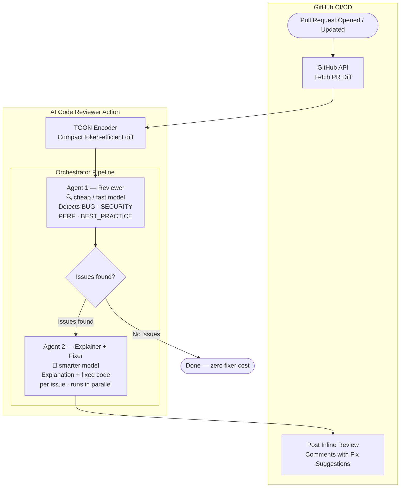

# PRowl

**The multi-agent PR reviewer that never misses a bug.**

Open-source, self-hostable GitHub Action. Works with **any LLM provider**.

## How It Works



1. Triggers on PR open/update
2. Fetches code diff from GitHub
3. Encodes all changed chunks into token-efficient TOON format
4. **Agent 1 (Reviewer)** — sends the full TOON diff to a cheap/fast model; detects `BUG`, `SECURITY`, `PERFORMANCE`, `BEST_PRACTICE` issues and returns a typed list
5. If no issues are found → pipeline stops; **Agent 2 is never called** (zero extra cost)
6. **Agent 2 (Explainer+Fixer)** — for each flagged chunk (not the full diff), generates an explanation and corrected code in a single LLM call; all issues are processed in parallel
7. Posts inline PR comments with: issue type label, concise explanation, and a GitHub suggestion block with the fixed code

## Features

- 🔓 **Open Source** - Self-hostable, no vendor lock-in
- 🔑 **BYOK** - Bring Your Own API Key
- 🌐 **Multi-Provider** - OpenAI, Groq, Mistral, DeepSeek, Gemini, and more
- ⚡ **Token-Efficient** - 50-70% cost reduction with TOON encoding
- 🤖 **2-Agent Pipeline** - Cheap model detects issues; smarter model explains and fixes them
- 💰 **Zero Downstream Cost** - Fixer agent is skipped entirely when no issues are found

## Supported Providers

Works with any OpenAI-compatible API:

| Provider | Free Tier? | Base URL |
|----------|------------|----------|
| [OpenAI](https://platform.openai.com) | No | *(default)* |
| [Groq](https://groq.com) | ✅ Yes | `https://api.groq.com/openai/v1` |
| [DeepSeek](https://platform.deepseek.com) | ✅ Yes | `https://api.deepseek.com/v1` |
| [Mistral](https://mistral.ai) | ✅ Yes | `https://api.mistral.ai/v1` |
| [Together AI](https://together.ai) | ✅ Yes | `https://api.together.xyz/v1` |
| [Fireworks](https://fireworks.ai) | ✅ Yes | `https://api.fireworks.ai/inference/v1` |
| [OpenRouter](https://openrouter.ai) | No | `https://openrouter.ai/api/v1` |
| [Google Gemini](https://ai.google.dev) | ✅ Yes | `https://generativelanguage.googleapis.com/v1beta/openai` |

## Quick Start

### 1. Get an API Key

Pick any provider above. For free options, try **Groq** or **DeepSeek**.

### 2. Add Secret to Your Repo

Go to: **Settings → Secrets → Actions → New repository secret**
- Name: `LLM_API_KEY`
- Value: Your API key

### 3. Create Workflow

Create `.github/workflows/ai-review.yml`:

```yaml
name: AI Code Review

on:
  pull_request:
    types: [opened, synchronize]

permissions:
  contents: read
  pull-requests: write

jobs:
  review:
    runs-on: ubuntu-latest
    steps:
      - uses: actions/checkout@v3
      - uses: tusharshah21/ai-code-reviewer@main
        with:
          GITHUB_TOKEN: ${{ secrets.GITHUB_TOKEN }}
          LLM_API_KEY: ${{ secrets.LLM_API_KEY }}
          LLM_MODEL: "gpt-4o"

# Optional: Discord + Slack notifications

Add any of these optional secrets if you want commit-trigger and review-result notifications in chat:

- `DISCORD_WEBHOOK_URL` for Discord channel notifications
- `SLACK_BOT_TOKEN` + `SLACK_CHANNEL_ID` for threaded Slack notifications (recommended)
- `SLACK_WEBHOOK_URL` for basic Slack notifications (fallback, non-threaded)

Example:

```yaml
      - uses: tusharshah21/ai-code-reviewer@main
        with:
          GITHUB_TOKEN: ${{ secrets.GITHUB_TOKEN }}
          LLM_API_KEY: ${{ secrets.LLM_API_KEY }}
          LLM_MODEL: "gpt-4o"
          DISCORD_WEBHOOK_URL: ${{ secrets.DISCORD_WEBHOOK_URL }}
          SLACK_BOT_TOKEN: ${{ secrets.SLACK_BOT_TOKEN }}
          SLACK_CHANNEL_ID: ${{ secrets.SLACK_CHANNEL_ID }}
```
```

That's it! PRs will now get AI reviews with explanation and fix suggestions.

#### Optional: Use separate models for detection vs. fixing

```yaml
      - uses: tusharshah21/ai-code-reviewer@main
        with:
          GITHUB_TOKEN: ${{ secrets.GITHUB_TOKEN }}
          LLM_API_KEY: ${{ secrets.LLM_API_KEY }}
          LLM_REVIEWER_MODEL: "gpt-4o-mini"   # cheap & fast for triage
          LLM_FIXER_MODEL: "gpt-4o"           # smarter for explanations & fixes
```

---

## Provider Examples

### OpenAI (default)
```yaml
LLM_API_KEY: ${{ secrets.OPENAI_API_KEY }}
LLM_MODEL: "gpt-4o"
```

### Groq (FREE & Fast)
```yaml
LLM_API_KEY: ${{ secrets.GROQ_API_KEY }}
LLM_MODEL: "llama-3.3-70b-versatile"
LLM_BASE_URL: "https://api.groq.com/openai/v1"
```

### DeepSeek (FREE & Cheap)
```yaml
LLM_API_KEY: ${{ secrets.DEEPSEEK_API_KEY }}
LLM_MODEL: "deepseek-chat"
LLM_BASE_URL: "https://api.deepseek.com/v1"
```

### Mistral AI
```yaml
LLM_API_KEY: ${{ secrets.MISTRAL_API_KEY }}
LLM_MODEL: "mistral-large-latest"
LLM_BASE_URL: "https://api.mistral.ai/v1"
```

### Google Gemini
```yaml
LLM_API_KEY: ${{ secrets.GOOGLE_API_KEY }}
LLM_MODEL: "gemini-1.5-flash"
LLM_BASE_URL: "https://generativelanguage.googleapis.com/v1beta/openai"
```

### Together AI
```yaml
LLM_API_KEY: ${{ secrets.TOGETHER_API_KEY }}
LLM_MODEL: "meta-llama/Llama-3.3-70B-Instruct-Turbo"
LLM_BASE_URL: "https://api.together.xyz/v1"
```

### OpenRouter (100+ models)
```yaml
LLM_API_KEY: ${{ secrets.OPENROUTER_API_KEY }}
LLM_MODEL: "anthropic/claude-3.5-sonnet"
LLM_BASE_URL: "https://openrouter.ai/api/v1"
```

---

## Configuration

| Input | Required | Default | Description |
|-------|----------|---------|-------------|
| `GITHUB_TOKEN` | Yes | - | Auto-provided by GitHub |
| `LLM_API_KEY` | Yes | - | Your provider's API key |
| `LLM_MODEL` | No | `gpt-4o` | Model used by **both** agents. If you only set this, both agents run on the same model. Set `LLM_REVIEWER_MODEL` / `LLM_FIXER_MODEL` to split them. |
| `LLM_BASE_URL` | No | OpenAI | Provider's API endpoint |
| `LLM_REVIEWER_MODEL` | No | `LLM_MODEL` | Fast/cheap model for issue detection (Agent 1). Overrides `LLM_MODEL` for Agent 1 only. |
| `LLM_FIXER_MODEL` | No | `LLM_MODEL` | Smarter model for explanation and fix generation (Agent 2). Overrides `LLM_MODEL` for Agent 2 only. |
| `exclude` | No | - | Files to skip (glob patterns) |
| `DISCORD_WEBHOOK_URL` | No | - | Posts a start message (commit/PR context) and a reply with reviewer results to Discord. |
| `SLACK_BOT_TOKEN` | No | - | Slack bot token (`xoxb-...`) used for threaded messages via `chat.postMessage`. |
| `SLACK_CHANNEL_ID` | No | - | Slack channel ID for bot-thread notifications. Used with `SLACK_BOT_TOKEN`. |
| `SLACK_WEBHOOK_URL` | No | - | Slack incoming webhook fallback (non-threaded) when bot token/channel are not provided. |

---

---

## Cost Comparison

TOON encoding saves 50-70% tokens. Example for reviewing 1000 lines:

| Provider | Model | Cost/Review |
|----------|-------|-------------|
| Groq | Llama 3.3 70B | **FREE** |
| DeepSeek | DeepSeek Chat | ~$0.001 |
| OpenAI | GPT-4o | ~$0.02 |
| OpenAI | GPT-4o-mini | ~$0.002 |

---

## Presentation

[View the PRowl pitch deck →](https://gamma.app/docs/The-multi-agent-PR-reviewer-that-never-misses-a-bug-di1s9mpkpq1kcb8)

---

## License

MIT - Free and open source
#PRowl